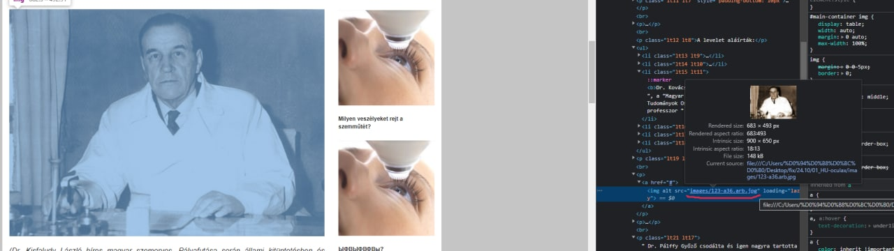

# Как легко и просто редактировать сайт с помощью Chrome

## Важно

Редачить можно `ТОЛЬКО В ПРИВАТЕ`

## Подготовка

> Необходимое расширение

> Переход в редактор

Чтобы зайти в редактор открываем транзитку в режим просмотра. Как только она открылась, открываем инспектор кода нажатием F12 (либо ПКМ -> Просмотреть код/Inspect)

> Важные замечания

Во время редактирования **не перезагружать** эту вкладку, иначе прогресс не сохранится!

Не забывайте, что вы может откатывать любое действие как обычно `Ctrl + Z`

---

## Как редактировать текст

Открываем консоль и вводдим следующую команду

```
document.designMode="on"
```


Нажимаем ENTER

> Обязательно, если копируете текст вставлять его через `Ctrl + Shift + V`, чтобы стили текста не переносились

Теперь без проблем редактируем текст прям на сайте, все интуитивно понятно и просто

---

## Как заменить картинку

В первую очередь заливаем фото на наш хостинг через CRM и берем ссылку

Нажимаем следующие клавиши или верхний левый значок в панели инспектора

```
Ctrl + Shift + C
```


Нажимаем на это фото и в инспекторе видим строчку следующего типа

```

```

Здесь нас интересует только атрибут **src**. Все что нужно это вставить ссылку внутрь кавычек после знака равно получим что-то типа (два раза нажимаем по синему тексту внутри кавычек, чтобы менять)

```

```



Картинка сразу должна измениться

---

## Как добавить блок (текст/картинку)

Нажимаем следующие клавиши или верхний левый значок в панели инспектора

```
Ctrl + Shift + C
```


Сначала находим тот блок по типу которого вы хотите получить новый


Выбираем в инспекторе этот блок, нажимаем ПКМ + Copy/Копировать -> Copy Element/ Копировать элемент

Затем ищем блок ПОСЛЕ которого нужно вставить ваш блок (с текстом картинкой) выбираем блок и жмем `Ctrl + V`

---

## Добавляем отступы

Нажимаем следующие клавиши или верхний левый значок в панели инспектора

```
Ctrl + Shift + C
```


Находим необходимый блок (необходимо кликнуть)

Затем смотрим в инспектор и ищем это поле


Для отсупа сверху

```
margin-top: 15px;
```

Для отсупа снизу

```
margin-bottom: 15px;
```

Значения можно менять

Выглядеть будет это следующим образом


---

## Как удалить блок

Нажимаем следующие клавиши или верхний левый значок в панели инспектора

```
Ctrl + Shift + C
```


Находим блок


Выбираем в инспекторе этот блок, нажимаем ПКМ + Удалить элемент/Delete element

---

## Как сохранить измнения

Листаем код на самый верх в инспекторе и находим тэг `<html>` нажимаем на него ПКМ + Copy/Копировать -> Copy Element/ Копировать элемент


Открываем ссылку https://codly.ru/editor/

Наводимся на верхнее левое окошко и вставляем скопированное из инспектора, затем на самую первую строчку вставляем это

```
<!DOCTYPE html>
```

затем жмем на иконку `≡` -> Download

Скачанный файл называем на index.html, заменяем на тот, который был и смотрим, что получилось

## Заливаем сайт

Если устроил результат - можно заливать к себе, архивируем рабочую папку целиком, обязательно в zip

Затем заменяем в keitaro
